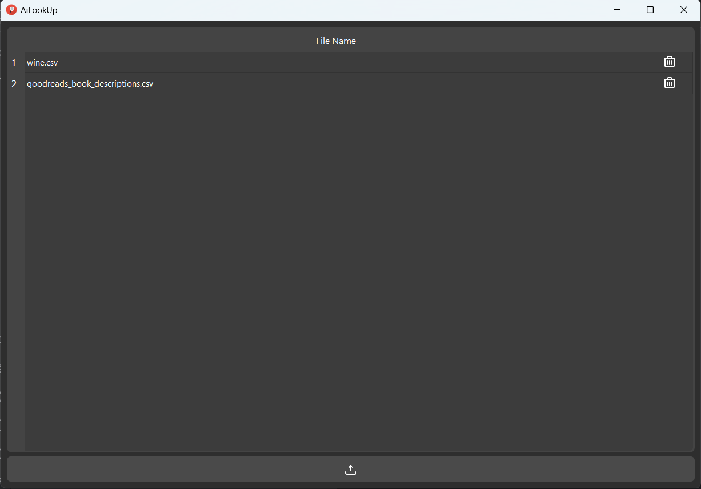

# AiLookUp

This project is a standalone, overpowered VLOOKUP powered by Sentence-BERT. It allows users to perform advanced lookup operations based on natural language input, leveraging the power of Sentence-BERT for semantic understanding.

This app allow users to load CSV or XLSX files and select columns containing natural language data. Once loaded, users can query their data using vague or descriptive phrases, enabling more flexible and intuitive searches through the dataset.


### Load Files
This is how you load files and select the descriptive column:


### Navigate Files
This is how you navigate files:


### Input Queries
This is how you input queries (the dataset is rearranged by similarity):


## Prerequisites

Make sure you have the following installed:

- **Python 3.11**: Download from [here](https://www.python.org/downloads/).
- **Git**: Download from [here](https://git-scm.com/downloads).

## Build Instructions

### 1. Clone the Repository

First, clone the repository to your local machine:

```bash
git clone https://github.com/FabioSol/AiLookUp.git
```

### 2. Create and Activate a Virtual Environment
Go to the cloned repository, create the venv and activate it:
```bash
cd AiLookUp
python -m venv venv #if you have multiple python versions use py -3.11 -m venv venv 
source venv/Scripts/activate
```

### 3. Install the Required Packages
Use pip to install the required packages listed in requirements.txt :
```bash
pip install -r requirements.txt
```

### 4. Build the Application
This will create and download the necessary files for the app tu run
```bash
python -m app.build
```
At this point you should be able to run the app in the repo with this command:

```bash
python -m app
```
feel free to load information so your build has it by default or edit the static file for styling


### Generate the Executable

For a single-file standalone:

```bash
pyinstaller app/__main__.py \
    --onefile \
    --add-data "app/model/model;app/model/model" \
    --add-data "app/db/data;app/db/data" \
    --add-data "app/static;app/static" \
    --icon=app/static/logo.ico \
    --name AiLookUp \
    --noconsole
```

Let's be real, you don't need a transformer in the same file as your app, and data will not be persistent this way, so
for a more reasonable approach, here is the command for one directory:

```bash
pyinstaller app/__main__.py \
    --add-data "app/model/model;app/model/model" \
    --add-data "app/db/data;app/db/data" \
    --add-data "app/static;app/static" \
    --icon=app/static/logo.ico \
    --name AiLookUp \
    --noconsole
```

your executable file should be in the `dist/` directory


Anyway, running torch this way is kind of slow, so if this repo gains some visibility, I might change the model part to run without dependencies.

